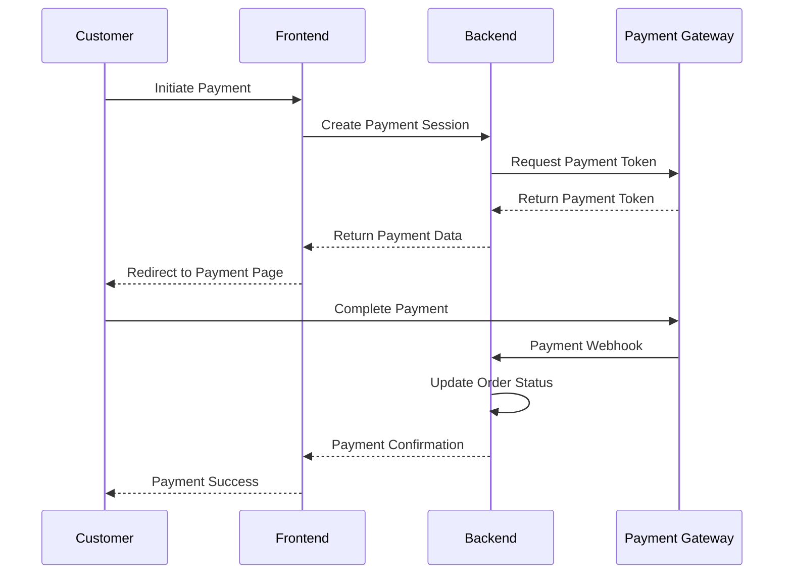

# EISHRO Platform Backend Architecture

## Introduction

This document outlines the backend architecture for the EISHRO e-commerce platform, designed to support a scalable, secure, and efficient e-commerce ecosystem for the Libyan market. The backend leverages serverless technologies to provide API endpoints, data persistence, and integrations with payment and logistics services.

## Technology Stack

### Serverless Runtime
- **Cloudflare Workers**: Serverless execution environment for API endpoints
- **Edge Runtime**: Global CDN deployment for low-latency responses
- **JavaScript/TypeScript**: Primary programming language for backend logic

### Database and Storage
- **Cloudflare D1**: SQLite-based relational database for structured data
- **Cloudflare KV**: Key-value storage for high-performance data access
- **R2 Storage**: Object storage for media files and assets

### API Framework
- **Hono.js**: Lightweight web framework for Cloudflare Workers
- **RESTful APIs**: Standard HTTP methods for resource management
- **GraphQL** (Future): Potential API evolution for complex queries

### Security and Authentication
- **JWT Tokens**: JSON Web Tokens for session management
- **OAuth 2.0**: Integration with external authentication providers
- **API Keys**: Service-to-service authentication

### Monitoring and Logging
- **Cloudflare Analytics**: Real-time performance monitoring
- **Custom Logging**: Structured logging for debugging and auditing

## Database Schema

### Core Entities

#### Products Table
```sql
CREATE TABLE products (
  id INTEGER PRIMARY KEY AUTOINCREMENT,
  store_id INTEGER NOT NULL,
  name TEXT NOT NULL,
  description TEXT,
  price DECIMAL(10,2) NOT NULL,
  category TEXT,
  images TEXT, -- JSON array of image URLs
  sizes TEXT, -- JSON array of available sizes
  colors TEXT, -- JSON array of color objects
  in_stock BOOLEAN DEFAULT TRUE,
  created_at DATETIME DEFAULT CURRENT_TIMESTAMP,
  updated_at DATETIME DEFAULT CURRENT_TIMESTAMP,
  FOREIGN KEY (store_id) REFERENCES stores(id)
);
```

#### Stores Table
```sql
CREATE TABLE stores (
  id INTEGER PRIMARY KEY AUTOINCREMENT,
  name TEXT NOT NULL,
  slug TEXT UNIQUE NOT NULL,
  logo TEXT,
  description TEXT,
  owner_id INTEGER,
  categories TEXT, -- JSON array of categories
  settings TEXT, -- JSON object for store settings
  is_active BOOLEAN DEFAULT TRUE,
  created_at DATETIME DEFAULT CURRENT_TIMESTAMP,
  updated_at DATETIME DEFAULT CURRENT_TIMESTAMP
);
```

#### Orders Table
```sql
CREATE TABLE orders (
  id TEXT PRIMARY KEY,
  store_id INTEGER NOT NULL,
  customer_info TEXT, -- JSON object
  items TEXT, -- JSON array of order items
  total DECIMAL(10,2) NOT NULL,
  shipping_info TEXT, -- JSON object
  payment_info TEXT, -- JSON object
  status TEXT DEFAULT 'pending',
  created_at DATETIME DEFAULT CURRENT_TIMESTAMP,
  updated_at DATETIME DEFAULT CURRENT_TIMESTAMP,
  FOREIGN KEY (store_id) REFERENCES stores(id)
);
```

#### Users Table
```sql
CREATE TABLE users (
  id INTEGER PRIMARY KEY AUTOINCREMENT,
  email TEXT UNIQUE NOT NULL,
  password_hash TEXT NOT NULL,
  role TEXT DEFAULT 'merchant',
  store_id INTEGER,
  profile TEXT, -- JSON object
  is_active BOOLEAN DEFAULT TRUE,
  created_at DATETIME DEFAULT CURRENT_TIMESTAMP,
  updated_at DATETIME DEFAULT CURRENT_TIMESTAMP,
  FOREIGN KEY (store_id) REFERENCES stores(id)
);
```

### Data Relationships
- **One-to-Many**: Store → Products, Store → Orders
- **One-to-One**: User → Store (for merchants)
- **Many-to-Many**: Products ↔ Categories (via junction table)

### Indexing Strategy
- Primary keys on all tables
- Foreign key indexes for referential integrity
- Composite indexes on frequently queried columns (store_id + status, etc.)
- Full-text search indexes for product names and descriptions

## Authentication

### Merchant Authentication
- **Registration**: Email verification and password setup
- **Login**: JWT-based session management with refresh tokens
- **Password Reset**: Secure token-based password recovery
- **Multi-factor Authentication**: Optional 2FA for enhanced security

### API Authentication
- **Bearer Tokens**: JWT tokens in Authorization header
- **API Keys**: For third-party integrations and service accounts
- **Session Management**: Automatic token refresh and expiration

### Authorization
- **Role-Based Access Control (RBAC)**:
  - **Merchant**: Full access to their store data
  - **Admin**: Platform-wide administrative access
  - **Customer**: Read-only access to public data
- **Store Isolation**: Merchants can only access their own store data
- **Resource-Level Permissions**: Granular control over specific operations

### Security Measures
- **Password Hashing**: bcrypt with salt for secure storage
- **Token Expiration**: Short-lived access tokens with refresh mechanism
- **Rate Limiting**: API rate limiting to prevent abuse
- **CORS Configuration**: Proper cross-origin resource sharing setup

## API Design

### RESTful Endpoints

#### Store Management
```
GET    /api/stores/:storeId          # Get store details
PUT    /api/stores/:storeId          # Update store settings
DELETE /api/stores/:storeId          # Deactivate store
```

#### Product Management
```
GET    /api/stores/:storeId/products  # List store products
POST   /api/stores/:storeId/products  # Create new product
GET    /api/products/:productId      # Get product details
PUT    /api/products/:productId      # Update product
DELETE /api/products/:productId      # Delete product
```

#### Order Management
```
GET    /api/stores/:storeId/orders    # List store orders
POST   /api/stores/:storeId/orders    # Create new order
GET    /api/orders/:orderId           # Get order details
PUT    /api/orders/:orderId/status    # Update order status
```

#### Authentication
```
POST   /api/auth/login               # User login
POST   /api/auth/register            # User registration
POST   /api/auth/refresh             # Token refresh
POST   /api/auth/logout              # User logout
```

### API Response Format
```json
{
  "success": true,
  "data": { ... },
  "message": "Operation successful",
  "timestamp": "2024-01-01T00:00:00Z"
}
```

### Error Handling
```json
{
  "success": false,
  "error": {
    "code": "VALIDATION_ERROR",
    "message": "Invalid input data",
    "details": { ... }
  },
  "timestamp": "2024-01-01T00:00:00Z"
}
```

### Pagination
```json
{
  "success": true,
  "data": [...],
  "pagination": {
    "page": 1,
    "limit": 20,
    "total": 150,
    "totalPages": 8
  }
}
```

### Rate Limiting
- **Authenticated Requests**: 1000 requests per hour
- **Unauthenticated Requests**: 100 requests per hour
- **Payment Requests**: 50 requests per hour

## Payment Integration

### Moamalat Payment Gateway

#### Integration Architecture
- **SDK Integration**: Direct integration with Moamalat's payment SDK
- **Supported Methods**: Credit cards, debit cards, bank transfers
- **Currency Support**: Libyan Dinar (LYD) primary, USD secondary
- **Security**: PCI DSS compliant with end-to-end encryption

#### Transaction Flow
1. **Payment Initiation**: Frontend requests payment session
2. **Token Generation**: Backend creates secure payment token
3. **Gateway Redirect**: User redirected to Moamalat payment page
4. **Callback Handling**: Payment status updates via webhooks
5. **Order Completion**: Order status updated based on payment result

#### Supported Banks
- Commercial Banks: Jumhouria, Sahara, Wahda, Wahda Islamic, etc.
- Development Banks: Agriculture, Housing, Investment banks
- Islamic Banks: Libyan Islamic, Al-Wahda Islamic

### Additional Payment Methods

#### Digital Wallets
- **MobiCash**: Mobile wallet integration
- **Sadad**: National payment platform
- **Tadawul**: Stock exchange payment system
- **1Pay**: Unified payment platform

#### Alternative Methods
- **Bank Transfers**: Direct account-to-account transfers
- **Cash on Delivery**: Traditional payment upon delivery
- **Credit/Debit Cards**: International card acceptance

### Payment Processing Flow


### Transaction Security
- **Tokenization**: Sensitive payment data never stored
- **Encryption**: All payment communications encrypted
- **Fraud Detection**: Basic fraud prevention measures
- **Audit Trail**: Complete transaction logging

## Deployment

### Cloudflare Workers Deployment

#### Build Process
```bash
# Install dependencies
npm install

# Build for production
npm run build

# Deploy to Cloudflare
wrangler deploy
```

#### Environment Configuration
```toml
# wrangler.toml
name = "eishro-backend"
main = "src/index.ts"
compatibility_date = "2024-01-01"

[vars]
API_BASE_URL = "https://api.eshro.ly"
PAYMENT_GATEWAY_URL = "https://payment.moamalat.ly"

[[d1_databases]]
binding = "DB"
database_name = "eishro-db"
database_id = "your-database-id"

[[kv_namespaces]]
binding = "CACHE"
id = "your-kv-namespace-id"
```

### Database Deployment
- **D1 Database**: Automatic deployment with schema migrations
- **KV Namespaces**: Provisioned for caching and session storage
- **R2 Buckets**: Configured for media file storage

### Environment Management
- **Development**: Local development with Wrangler dev server
- **Staging**: Separate environment for testing and QA
- **Production**: Live environment with monitoring and backups

### Monitoring and Observability
- **Cloudflare Analytics**: Real-time performance metrics
- **Custom Dashboards**: Application-specific monitoring
- **Error Tracking**: Sentry integration for error reporting
- **Logging**: Structured logging with correlation IDs

### Scaling Strategy
- **Horizontal Scaling**: Automatic scaling via Cloudflare's edge network
- **Caching Layer**: KV storage for frequently accessed data
- **CDN Integration**: Global content delivery for static assets
- **Rate Limiting**: Built-in protection against abuse

### Backup and Recovery
- **Database Backups**: Automated D1 database snapshots
- **Data Retention**: Configurable data retention policies
- **Disaster Recovery**: Multi-region deployment capabilities
- **Rollback Procedures**: Version-based deployment rollbacks

---

*This backend architecture document provides a comprehensive overview of the EISHRO platform's server-side infrastructure, designed for scalability, security, and seamless integration with Libyan financial and logistics systems.*