# EISHRO Platform Workflow

## Main Platform Workflow

The following Mermaid diagram illustrates the comprehensive user workflows within the EISHRO Platform version 4.3, covering enhanced merchant store creation, customer shopping experiences, and advanced integrations.

```mermaid
flowchart TD
    %% User Entry Points
    A[Platform Access] --> B{User Type?}
    B -->|Merchant| C[Enhanced Merchant Registration]
    B -->|Customer| D[Multi-Store Marketplace]
    B -->|Visitor| E[Account Type Selection]

    %% Enhanced Merchant Registration Flow
    C --> F[Email Verification & Setup]
    F --> G[Merchant Profile Configuration]
    G --> H[Store Creation Wizard]

    %% Enhanced Store Creation
    H --> I[Store Type Selection]
    I --> J{Nawaem<br/>Fashion Store}
    I --> K{Sheirine<br/>Jewelry Store}
    I --> L{Delta Store<br/>General Retail}
    I --> M{Custom Store<br/>Template}

    J --> N[Store Configuration & Branding]
    K --> N
    L --> N
    M --> N

    N --> O[Product Management System]
    O --> P[Add Products with Variants<br/>Images, Sizes, Colors]
    P --> Q[Inventory & Pricing Setup]
    Q --> R[Payment Gateway Integration]
    R --> S[Store Launch & Publishing]

    %% Enhanced Merchant Dashboard
    S --> T[Advanced Merchant Dashboard]
    T --> U[Real-time Analytics]
    T --> V[Enhanced Order Management]
    T --> W[Customer Communication Hub]
    T --> X[Inventory Management]
    T --> Y[Financial Reports]

    %% Customer Experience Flow
    D --> Z[Store Discovery & Search]
    Z --> AA[Category-based Navigation]
    AA --> BB[Product Display with Reviews]
    BB --> CC[Enhanced Product Details<br/>Images, Videos, 360° View]

    %% Advanced Shopping Cart
    CC --> DD[Add to Cart with Options]
    DD --> EE[Smart Shopping Cart]
    EE --> FF[Quantity Management]
    FF --> GG[Cart Persistence & Sync]

    %% Enhanced Checkout Process
    GG --> HH{Checkout Process}
    HH -->|Continue Shopping| BB
    HH -->|Proceed to Checkout| II[Multi-step Checkout Wizard]

    II --> JJ[Customer Information Forms]
    JJ --> KK[City & Area Selection]
    KK --> LL[Shipping Method Selection]
    LL --> MM[Advanced Payment Gateway]

    %% Enhanced Payment System
    MM --> NN[Payment Method Selection]
    NN --> OO{Moamalat Gateway Integration}
    NN --> PP[Alternative Payment Methods]
    NN --> QQ[Digital Wallets & Cards]

    OO --> RR[Secure Payment Processing]
    PP --> RR
    QQ --> RR

    RR --> SS{Payment Status}
    SS -->|Success| TT[Order Confirmation]
    SS -->|Failed| UU[Payment Error Handling]
    UU --> NN

    %% Enhanced Order Management
    TT --> VV[Order Tracking System]
    VV --> WW[Real-time Status Updates]
    WW --> XX[Delivery Notifications]
    XX --> YY[Order Completion & Review]

    %% Advanced Features
    E --> ZZ[Visitor Registration System]
    ZZ --> AAA[Account Type Selection]
    AAA --> BBB[Enhanced Onboarding Flow]

    %% Integration Points
    V --> CCC[Order Processing Automation]
    CCC --> DDD[Shipping Integration]
    DDD --> EEE[Notification Systems]

    %% Analytics & Reporting
    U --> FFF[Advanced Sales Analytics]
    FFF --> GGG[Customer Behavior Tracking]
    GGG --> HHH[Performance Metrics]

    %% Customer Service Integration
    W --> III[CRM Integration]
    III --> JJJ[Customer Support Tickets]
    JJJ --> KKK[Communication Management]
```

## Enhanced Workflow Descriptions

### 🚀 Enhanced Merchant Workflow (v4.3)
1. **Advanced Registration**: Enhanced email verification with merchant profile setup
2. **Intelligent Store Creation**: AI-powered store type suggestions with custom templates
3. **Comprehensive Configuration**: Advanced branding, payment, and shipping setup
4. **Smart Product Management**: Bulk upload, variant management, and inventory automation
5. **Advanced Dashboard**: Real-time analytics, order management, and customer insights
6. **Automated Operations**: Order processing, inventory alerts, and customer communication

### 🛒 Enhanced Customer Workflow (v4.3)
1. **Intelligent Discovery**: Advanced search, filtering, and recommendation engine
2. **Immersive Shopping**: Enhanced product views with multimedia content
3. **Smart Cart Management**: Persistent carts with synchronization across devices
4. **Streamlined Checkout**: Multi-step wizard with address validation and smart defaults
5. **Advanced Payment Options**: Multiple gateways with fallback mechanisms
6. **Real-time Tracking**: Live order updates with delivery notifications

### 🔧 Advanced Integration Points (v4.3)
- **Multi-Payment Processing**: Moamalat + alternative gateways with automatic failover
- **Smart Shipping**: Dynamic pricing, real-time tracking, and automated notifications
- **CRM Integration**: Customer service automation and support ticket management
- **Analytics Engine**: Advanced reporting with predictive insights
- **Notification Systems**: Multi-channel communication (SMS, email, push notifications)

### 📱 New Features in v4.3
- **Account Type Selection**: Enhanced visitor registration and account management
- **City Area Selection**: Intelligent location-based services
- **Sound Effects System**: Enhanced user experience with audio feedback
- **Invoice Generation**: Automated invoice creation and management
- **Multi-language Support**: Improved Arabic localization with RTL enhancements
- **Advanced Security**: Enhanced payment security and fraud detection

## Technical Enhancements

### Performance Optimizations
- **Code Splitting**: Advanced route-based and component-based splitting
- **Caching Strategy**: Intelligent caching with service worker implementation
- **Image Optimization**: WebP format with responsive loading
- **Bundle Optimization**: Tree shaking and dead code elimination

### Security Enhancements
- **Payment Security**: Enhanced tokenization and PCI DSS compliance
- **Data Protection**: Advanced encryption for sensitive information
- **Access Control**: Granular permissions and role-based security
- **Audit Trail**: Comprehensive logging and monitoring

### Scalability Features
- **Microservices Ready**: Modular architecture for future scaling
- **Database Optimization**: Efficient queries and indexing strategies
- **CDN Integration**: Global content delivery optimization
- **Load Balancing**: Traffic distribution and performance management

---

*This enhanced workflow documentation reflects EISHRO Platform version 4.3 with all current features, improvements, and integrations. The platform now provides a comprehensive, enterprise-grade e-commerce solution with advanced merchant tools and superior customer experience.*